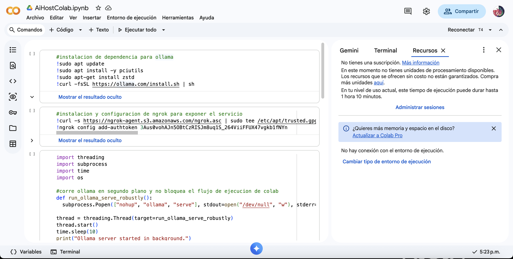
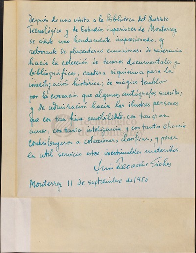
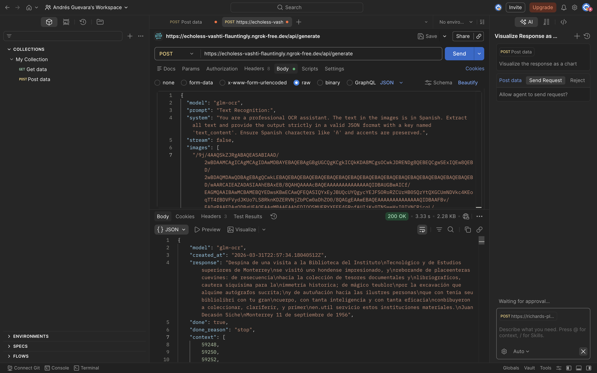

# Selección y Evaluación de Modelos OCR mediante Ollama

Este documento detalla el proceso de prueba y la justificación detrás de la elección del modelo OCR para el proyecto. El objetivo principal fue encontrar un modelo capaz de extraer texto de imágenes, específicamente manuscritos en español, manteniendo una alta precisión y tiempos de respuesta óptimos.

---

## Entorno de Prueba

Las pruebas de rendimiento y viabilidad se llevaron a cabo utilizando **Google Colab**. Esto nos permitió ejecutar los modelos sin depender de hardware local, configurando Ollama en segundo plano a través de un túnel con ngrok para exponer el servicio y realizar peticiones HTTP.

* **Enlace al cuaderno de pruebas:** [Colab - Evaluación OCR](https://colab.research.google.com/drive/1XlAKLMZOjJ9ZQYVJwhpT6dNm3nau0juD?usp=sharing)



---

## Modelos Evaluados

Se seleccionaron los **4 modelos de OCR más populares** disponibles dentro del ecosistema de Ollama para realizar las pruebas comparativas:

1.  `deepseek-ocr`
2.  `glm-ocr`
3.  `DedeProgames/orion-ocr`
4.  `scb10x/typhoon-ocr1.5-3b`

---

## Justificación de la Selección: `glm-ocr`

Tras someter los cuatro modelos a pruebas de reconocimiento de texto utilizando el prompt `"Text Recognition:"`, se seleccionó **`glm-ocr`** como la herramienta definitiva.

**Razones de la elección:**
* **Mejores resultados de transcripción:** Mostró una mayor capacidad para interpretar caligrafía y preservar caracteres especiales del español (como la 'ñ' y las tildes) en comparación con sus competidores.
* **Eficiencia de tiempo:** Entregó las respuestas en la menor franja de tiempo, oscilando consistentemente entre **1 a 10 segundos** por petición.

---

## Imagen de Prueba

Para validar la precisión de los modelos, se utilizó el siguiente documento manuscrito histórico.



---

## Ejemplo de Petición y Respuesta

Las pruebas se realizaron enviando peticiones estructuradas para obtener una salida estricta en formato JSON.



### Petición (Request)

```json
{
  "model": "glm-ocr",
  "prompt": "Text Recognition:",
  "system": "You are a professional OCR assistant. The text in the images is in Spanish. Extract all text and provide the output strictly in a valid JSON format with a key named 'text_content'. Ensure Spanish characters like 'ñ' and accents are preserved.",
  "stream": false,
  "images": [
    "Base64CodeImage"
  ]
}
```

### Respueta (Response)

```json
{
    "model": "glm-ocr",
    "created_at": "2026-03-31T22:57:34.18040512Z",
    "response": "Despina de una visita a la Biblioteca del Instituto\nTecnológico y de Estudios superiores de Monterrey\nse visitó uno hondense impresionado, y\nreborande de placeenteras cuevines: de resecuencia\nhacia la colección de tesores documentales y\nlibriograficos, cautera siquísima para la\nimmetría historica; de mágico teublor\npor la excavación que alquime autógrafos sucrita;\ny de autuñación hacia las ilustres personas\nque con tenía seu bibliolibri con tu gran\ncuerpo, con tanta inteligencia y con tanta eficacia\nconbibuyeron a coleccionar, clariferir, y primer\nen.util servicio estos instituciones materiales.\nJuan Decasón Siche\nMonterrey 11 de septiembre de 1956",
    "done": true,
    "done_reason": "stop",
    "context": [
        59248, 59250, 59252, 10, 4661, 599, 261, 7635, 665, 8480, 29151, 46, 678, 2815, 309, 283, 9331, 398, 309, 23845, 46, 48215, 873, 2815, 332, 3834, 283, 5725, 42062, 309, 261, 5758, 13015, 7099, 517, 261, 2657, 12523, 648, 1355, 21377, 13068, 42777, 23845, 13337, 1809, 648, 2857, 39, 332, 1438, 938, 599, 49228, 334, 59253, 10, 91, 4306, 45, 48, 93, 3649, 7404, 49600, 58, 59254, 10, 4512, 112, 2311, 360, 2323, 46548, 261, 658, 50707, 58227, 1323, 54962, 10, 84, 48804, 26339, 3098, 384, 360, 6828, 689, 3842, 4007, 29169, 360, 6265, 432, 14861, 10, 366, 5245, 724, 12029, 327, 1863, 2048, 56607, 303, 1604, 44, 384, 10, 265, 8016, 6003, 360, 3147, 9701, 305, 272, 585, 118, 2220, 58, 360, 42034, 8725, 5639, 10, 104, 38947, 658, 57913, 9392, 360, 38335, 4829, 4576, 4770, 384, 10, 4568, 510, 44216, 4277, 397, 44, 25451, 3196, 2223, 390, 8510, 6079, 1927, 658, 10, 348, 3616, 43066, 7206, 2206, 59, 360, 10361, 103, 3098, 1071, 560, 9874, 10, 3141, 658, 5171, 802, 2648, 930, 469, 390, 869, 1684, 14190, 9510, 397, 17805, 1410, 97, 351, 121, 360, 1684, 117, 2857, 2648, 30303, 2502, 2288, 679, 479, 16274, 10, 1562, 414, 45602, 14970, 33417, 354, 740, 510, 414, 5216, 12228, 10, 99, 4889, 3482, 44, 414, 258, 10366, 47937, 5639, 384, 414, 258, 10366, 41185, 38947, 10, 654, 98, 740, 3160, 35824, 261, 57913, 31197, 285, 44, 17390, 15258, 420, 44, 384, 21944, 10, 263, 8600, 29786, 21194, 7512, 39307, 4388, 271, 334, 74, 12911, 11439, 305, 1418, 363, 9410, 10, 12092, 432, 14861, 32, 49, 49, 360, 46904, 360, 32, 49, 57, 53, 54
    ],
    "total_duration": 2393413230,
    "load_duration": 436888979,
    "prompt_eval_count": 317,
    "prompt_eval_duration": 153847402,
    "eval_count": 215,
    "eval_duration": 1502402573
}
```